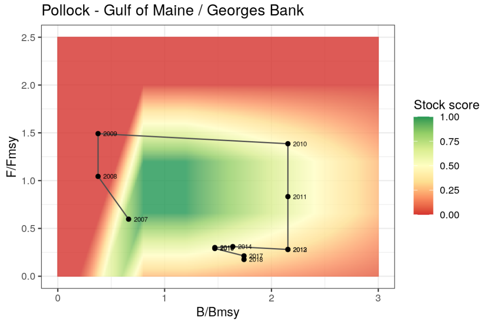

---
output:
  word_document: default
  html_document: default
---
### Fisheries stock status

**Layer type(s):** Wild-Caught Fisheries sub-goal layer

**Data description:**   

Stock assessment information was provided for 46 individual stocks via data request from the National Marine Fisheries Service for all stocks in the greater Northeast region from 2004 - 2018. Specifically, the metrics B/Bmsy and F/Fmsy (when available) were provided for the years in which they were assessed. Additional stock assessment information for species not in the NMFS stock assessment database were available in the RAM Legacy Stock Assessment database, this resulted in four additional stocks. Stock assessments for American lobster were collected from the Atlantic States Marine Fisheries Commission documents.

Assessment source | Stock | Metrics
------|---------------------|-------
ASMFC | American lobster, Gulf of Maine | B/Bmsy, F/Fmsy
ASMFC | American lobster, Southern New England | B/Bmsy, F/Fmsy
NMFS  | Acadian redfish | B/Bmsy, F/Fmsy
NMFS  | American plaice | B/Bmsy, F/Fmsy
NMFS  | Atlantic cod, George's Bank | B/Bmsy, F/Fmsy     
NMFS  | Atlantic cod, Gulf of Maine | B/Bmsy, F/Fmsy     
NMFS  | Atlanic halibut | B/Bmsy, F/Fmsy
NMFS  | Atlantic herring | B/Bmsy, F/Fmsy
NMFS  | Atlantic mackerel | B/Bmsy, F/Fmsy
NMFS  | Surf clam | B/Bmsy, F/Fmsy
NMFS  | Atlantic wolffish | B/Bmsy, F/Fmsy
NMFS  | Barndoor skate | B/Bmsy
NMFS  | Black sea bass | B/Bmsy, F/Fmsy
NMFS  | Bluefish | B/Bmsy, F/Fmsy
NMFS  | Butterfish | B/Bmsy, F/Fmsy
NMFS  | Clearnose skate | B/Bmsy
NMFS  | Monkfish/anglerfish/goosefish, Gulf of Maine/Northern Georges Bank | B/Bmsy, F/Fmsy
NMFS  | Monkfish/anglerfish/goosefish, Southern Georges Bank/Mid-Atlantic | B/Bmsy, F/Fmsy
NMFS  | Haddock, George's Bank | B/Bmsy, F/Fmsy
NMFS  | Haddock, Gulf of Maine | B/Bmsy, F/Fmsy
NMFS  | Little (Summer) skate | B/Bmsy
NMFS  | Squid/Loligo
NMFS  | Ocean pout | B/Bmsy, F/Fmsy
NMFS  | Ocean quahog | B/Bmsy, F/Fmsy
NMFS  | Pollock | B/Bmsy, F/Fmsy
NMFS  | Red hake, Gulf of Maine/Northern Georges Bank | B/Bmsy, F/Fmsy
NMFS  | Red hake, Southern Georges Bank/Mid-Atlantic | B/Bmsy, F/Fmsy
NMFS  | Scup/Porgy | B/Bmsy, F/Fmsy
NMFS  | Sea scallop | B/Bmsy, F/Fmsy
NMFS  | Silver hake/Whiting, Gulf of Maine/Northern Georges Bank | B/Bmsy, F/Fmsy
NMFS  | Silver hake/Whiting, Southern Georges Bank/Mid-Atlantic | B/Bmsy, F/Fmsy
NMFS  | Smooth skate | B/Bmsy
NMFS  | Spiny dogfish | B/Bmsy, F/Fmsy
NMFS  | Summer flounder | B/Bmsy, F/Fmsy
NMFS  | Thorny skate | B/Bmsy
NMFS  | Tilefish | B/Bmsy, F/Fmsy
NMFS  | Blueline tilefish | B/Bmsy, F/Fmsy
NMFS  | Golden tilefish | B/Bmsy, F/Fmsy
NMFS  | White hake | B/Bmsy, F/Fmsy
NMFS  | Sand-dab flounder/Windowpane/Brill, Gulf of Maine/Georges Bank | B/Bmsy, F/Fmsy
NMFS  | Sand-dab flounder/Windowpane/Brill, Southern New England/Mid-Atlantic | B/Bmsy, F/Fmsy
NMFS  | Winter flounder, Georges Bank | B/Bmsy, F/Fmsy
NMFS  | Winter flounder, Southern New England/Mid-Atlantic | B/Bmsy, F/Fmsy
NMFS  | Winter flounder, Gulf of Maine | B/Bmsy, F/Fmsy
NMFS  | Winter skate | B/Bmsy
NMFS  | Witch flounder | B/Bmsy, F/Fmsy
NMFS  | Yellowtail flounder, Cape Cod/Gulf of Maine | B/Bmsy, F/Fmsy
NMFS  | Yellowtail flounder, Georges Bank | B/Bmsy, F/Fmsy
NMFS  | Yellowtail flounder, Southern New England/Mid-Atlantic | B/Bmsy, F/Fmsy
RAM   | Menhaden | B/Bmsy, F/Fmsy
RAM   | Skipjack tuna | B/Bmsy, F/Fmsy
RAM   | Striped bass | B/Bmsy, F/Fmsy
RAM   | Weakfish | B/Bmsy

### Methods

Each stock is rescaled to be between 0 (least sustainable) and 1 (most sustainable) using stock assessment metrics $B/B_{MSY}$ and, when available, $F/F_{MSY}$. 

#### Rescaling $B/B_{MSY}$

The amount of biomass in the water ($B$) compared to the amount of biomass that can be harvested at maximum sustainable yield ($B_{MSY}$) provides a metric for knowing whether a single stock is fully exploited (0.8 < $B/B_{MSY}$ < 1.2), overfished ($B/B_{MSY}$ < 0.8) or underfished ($B/B_{MSY}$ > 1.2). The stock biomass score ($B'$) for each stock is calculated based on $B/B_{MSY}$, where

$$ B' = \begin{cases} B/B_{MSY},& B/B_{MSY} < 0.8,\\
1,& 0.8 < B/B_{MSY} < 1.2, \\
\frac{thresh - B/B_{MSY}}{thresh-pen} , & 1.2 < B/B_{MSY} < 3.0,\\
0.25, & B/B_{MSY} >= 3.0
\end{cases}$$

underexploitation penalty, $pen$ = 0.25 (a stock can not receive lower than 0.25 if underexploited)  
underxploitation threshold, $thresh$ = 3 (once a stock has a $B/B_{MSY}$ of 3 or greater, it will receive a score of 0.25)  

#### Rescaling $F/F_{MSY}$

Rescaled fishing mortality F' for each stock is calculated for stocks that have an assessed fishing mortality rate ($F/F_{MSY}$). This allows scores to reflect whether management actions have been taken to reduce fishing pressure, in particular for stocks that are overfished. As such, if a stock is overfished (B/BMSY < 0.8) but F/FMSY is reduced to account for rebuilding, F’ is set to 1 and the stock can receive the highest score of 1. A three year rolling-mean is also applied to $F'$ since fishing mortality fluctuate significantly in a short amount of time in response to a management decision. . This is not done for $B`$ as it is a less sensitive metric since it relies on biological processes.

When $B/B_{MSY}$ >= 0.8, a perfect score of 1 is assigned if $F/F_{MSY}$ is between 0.66 and 1.2. If $F/F_{MSY}$ is greater than 1.2, $F`$ decreases linearly towards 0, and once $F/F_{MSY}$ is greater than 2.0, indicating overfishing, $F`$ goes to 0. If $F/F_{MSY}$ is less than 0.66, indicating underfishing, $F`$ decreases linearly to a minimum score of 0.25.

$$ F' = \begin{cases} 0,& F/F_{MSY} >= 2.0,\\
\frac{2 - F/F_{MSY}}{0.8},& 1.2 < F/F_{MSY} < 2.0, \\
1 , & 0.66 < F/F_{MSY} < 1.2, \\
0.25 + \frac{0.75F/F_{MSY}}{0.66},& F/F_{MSY} < 0.66
\end{cases}$$

When $B/B_{MSY}$ < 0.8 & $F/F_{MSY}$ < 2.0, the model is altered to allow for low levels of fishing ($F/F_{MSY}$) for overfished stocks as a management measure. In these cases, $F/F_{MSY}$ is first translated into a new parameter, $F$ based on the slope of the line from from $B/B_{MSY} = 0.8$ to $0$:

$$F = F/F_{MSY} + \frac{1.2 - B/B_{MSY}}{0.7}$$
then,

$$ F' = \begin{cases} 0,& F >= 2.0,\\
\frac{2 - F}{0.8},& 1.2 < F < 2.0, \\
1 , & 0.66 < F < 1.2, \\
0.25 + \frac{0.75F}{0.66},& F < 0.66
\end{cases}$$

#### Calculating stock scores

The final stock score ($SS$) is the product of $B`$ and $F`$. If only $B/B_{MSY}$ is available, $SS = B`$. 

$$ SS = F'*B'$$

Here is an example of how $B/B_{MSY}$ and $F/F_{MSY}$ values are turned into stock scores between 0 and 1 for Pollock in the Gulf of Maine/Georges Bank:

**Wild-Caught Fisheries goal layer**  
The final stock status layer lists each stock and it's stock score between 0 and 1. This is then combined with the fisheries landings data in the Wild-Caught Fisheries model to match stocks with the regions in which they are caught, and their stock scores are catch-weighted according to the proportional catch each stock makes up for each region.

**Gapfilling**  
Stock assessments are not performed every year for every managed stock in a region. This necessitates some gapfilling for years where information is not provided. All missing values for $B/B_{MSY}$ and $F/F_{MSY}$ were gapfilled with the most recent known value.

**References**  
National Marine Fisheries Service. (2018). Stock assessment data for the Northeast and Mid-Atlantic stocks managed by NOAA. Provided via email from Jefferey Vieser. 14 December 2018.

RAM Legacy Stock Assessment Database. (2020). RAM Legacy Stock Assessment Database v4.491 (Version v4.491) [Data set]. Zenodo. http://doi.org/10.5281/zenodo.3676088
